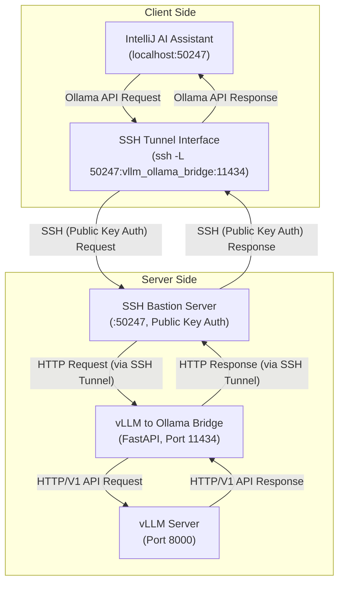

# vLLM AS Ollama - Use vLLM as IntelliJ AI Assistant

[한국어 README](README_ko.md) | [English README](README.md)


[](http://www.wtfpl.net/)
[](https://github.com/daanta-real/vllm-as-ollama/stargazers)
[](https://github.com/daanta-real/vllm-as-ollama/network/members)

## 🚀 Overview

This project disguises vLLM as Ollama, making it safely usable within IntelliJ AI Assistant.

## 💡 Why this project?

The latest version of IntelliJ AI Assistant allows users to connect custom LLM runners.

However, I've found two issues in the process of setting this up:

1. It doesn't support vLLM.
For typical users, small-scale LLM runners often lack sufficient specifications, making performance critical.
In such cases, it's better to use vLLM over Ollama for even slightly better text performance.
However, IntelliJ does not support vLLM (specifically, it doesn't support LLM runners that comply with the OpenAPI standard).
2. HTTPS setup is difficult.
When remotely accessing an LLM, it's essential to connect via HTTPS for security.
Unfortunately, in small-scale environments like homes, most users don't have domains and must connect via an IP address.
Regrettably, free certificate authorities like Let's Encrypt do not issue SSL certificates for IP addresses, meaning HTTPS cannot be used.

So this project addresses the above problems, enabling anyone to connect and use vLLM with IntelliJ:
1. vLLM is wrapped with an Ollama API Bridge, making it appear as Ollama, thus allowing IntelliJ to recognize and use vLLM.
2. SSH tunneling is used to securely send and receive HTTP requests/responses via SSH.
3. These settings are integrated into a single Docker Compose configuration, making setup and reuse quick and easy.

This project will continue to be updated until IntelliJ natively supports all these features, rendering this solution unnecessary.

## ⚙ Architecture Structure

The architecture roughly has the following structure:

Server-side [vLLM → Ollama-compatible API → Server-side SSH] → (SSH Tunneling) → Client-side [SSH Tunneling → IntelliJ]

Here's a detailed diagram of this architecture:



## 📁 Repository File Structure

```bash
📁 /
├─ 📁 vllm/                                 ### Defines the Docker image for vLLM (almost identical to a vanilla vLLM)
│   ├─ 🐬 Dockerfile
├─ 📁 vllm_ollama_bridge/                   ### Defines the Docker image containing the Python Ollama API bridge (Ollama API bridge interface for vLLM)
│   ├─ 🐬 Dockerfile
│   └─ 🐍 vllm_ollama_bridge_server.py
├─ 📁 ssh_bastion/                          ### HTTP to SSH tunneling server for secure HTTP communication
│   ├─ 🐬 Dockerfile
│   ├─ (🔑 vllm_admin.pub)                  ### Public key file for the tunneling server, for administrators (You need to create and place this before Docker build)
│   └─ (🔑 vllm_service_user.pub)           ### Public key file for the tunneling server, for users (You need to create and place this before Docker build)
├── 🐳 docker-compose.yml
└── README.md
```

## 📋 Getting Started

### System Requirements

* OS: Choose one of Windows, Linux, or macOS.
* GPU: An Nvidia GPU is required, and you must install the NVIDIA Container Toolkit.
* Docker: You'll need to install either Docker Desktop (for Windows/macOS) or Docker Engine (for Linux).
* Model: You must pre-download a vLLM-compatible model repository to your local machine.

  - Note: GGUF models are not supported. Please download a vLLM-compatible model (e.g., Llama3-1.5B).
* IntelliJ: You'll need either IntelliJ Community or IDEA, with the AI Assistant (JetBrains AI Assistant) plugin installed.

### Installation & Run

1.  Clone the Repository: Navigate to your desired directory (referred to as "repository folder") and run the following command:
    ```bash
    git clone https://github.com/daanta/vllm-as-ollama.git
    ```

2. Generate and Prepare SSH Connection Keys (Public and Private)
    ```
    1. Navigate to your user folder
    ▣▣▣        Windows CMD       ▣▣▣
    cd %USERPROFILE%
    ▣▣▣    Windows Powershell    ▣▣▣
    cd $env:USERPROFILE
    ▣▣▣ Linux / MacOS / Git Bash ▣▣▣
    cd ~
    
    2. Generate SSH keys
    ※ When prompted for a passphrase, simply press Enter for no passphrase.
    ▣▣▣       Windows CMD        ▣▣▣
    ssh-keygen -t rsa -b 4096 -m PEM -C "vllm_admin" -f "%USERPROFILE%\.ssh\vllm_admin"
    ssh-keygen -t rsa -b 4096 -m PEM -C "vllm_service_user" -f "%USERPROFILE%\.ssh\vllm_service_user"
    ▣▣▣    Windows Powershell    ▣▣▣
    ssh-keygen -t rsa -b 4096 -m PEM -C "vllm_admin" -f "$env:USERPROFILE\.ssh\vllm_admin"
    ssh-keygen -t rsa -b 4096 -m PEM -C "vllm_service_user" -f "$env:USERPROFILE\.ssh\vllm_service_user"
    ▣▣▣ Linux / MacOS / Git Bash ▣▣▣
    ssh-keygen -t rsa -b 4096 -m PEM -C "vllm_admin" -f ~/.ssh/vllm_admin
    ssh-keygen -t rsa -b 4096 -m PEM -C "vllm_service_user" -f ~/.ssh/vllm_service_user
    
    3. Copy public keys: If successful, four files (vllm_admin, vllm_admin.pub, vllm_service_user, vllm_service_user.pub) will be created. Copy the vllm_admin.pub and vllm_service_user.pub files into the ssh_bastion folder within your repository folder.
    ```


3. Edit `docker-compose.yml`: Modify and save the model name and path for the vLLM server:

   `services.vllm_server.build.args.MODEL_NAME` → Enter the model name.

   `services.vllm_server.volumes` → Enter the model's path.


4. Build Docker Compose: Navigate to the folder containing the `docker-compose.yml` file and run the following command to build the Docker Compose services
    ```bash
    docker compose build
    ```

5. Start the Server: On the server side, run the Docker Compose services you just built:

   ```bash
   docker compose up -d
   ```

6. Run on the Client-side (User): Open the SSH tunnel and connect it to IntelliJ. You'll need to re-run this command after each reboot.

   ① Start the SSH Tunnel: Open an SSH tunnel in the background to connect to the server-side SSH. You'll need an SSH client installed (like OpenSSH).

   ```bash
   ▣▣▣       Windows CMD        ▣▣▣
   start /B ssh -i "%USERPROFILE%\.ssh\vllm_service_user" -N -L 50247:vllm_ollama_bridge:11434 vllm_service_user@<server_address> -p 50247
   ▣▣▣    Windows Powershell    ▣▣▣
   ssh -i "$env:USERPROFILE\.ssh\vllm_service_user" -N -f -L 50247:vllm_ollama_bridge:11434 vllm_service_user@<server_address> -p 50247
   ▣▣▣ Linux / MacOS / Git Bash ▣▣▣
   ssh -i ~/.ssh/vllm_service_user -N -f -L 50247:vllm_ollama_bridge:11434 vllm_service_user@<server_address> -p 50247
   ```

   ② Test Connection: Use curl to send an HTTP request and verify that the Ollama bridge (which is actually vLLM) is running correctly.

   ```bash
   curl http://localhost:50247/api/tags
   ```

   ③ Register and Connect the Server in IntelliJ AI Assistant
   1) Go to Settings > Tools > AI Assistant > Models.
   2) Check Enable Ollama and enter http://localhost:50247.

      ⚠️ Important: Do not include a trailing / at the end of the URL.
   3) Click the Test Connection button and confirm that you see a ✅ Connected message.
   4) Great job! You can now select your model under "Local Models" and start using it immediately.

## 🤝 Contributing

You can report bugs and suggest features on the [Issues](https://github.com/daanta-real/vllm-as-ollama/issues) page.

Honestly, I'm not a fan of rigid writing. I'd really appreciate it if you could just write something like a daily diary entry or a late-night snack recommendation, similar to what you'd find at https://github.com/god/earth/issues.

## 📄 License

This project strictly adheres to the WTFPL license. Feel free to modify and use it as you wish.
