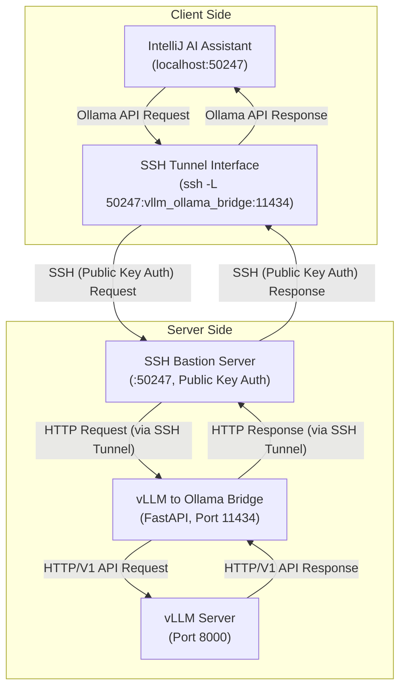

# vLLM AS Ollama - IntelliJ AI Assistant에서 vLLM 쓰기

👉🏻👉🏻👉🏻 [📌🇰🇷 한국어 README](README_ko.md) | [📌🇺🇸 English README](README.md) 👈🏻👈🏻👈🏻


[](http://www.wtfpl.net/)
[](https://github.com/daanta-real/vllm-as-ollama/stargazers)
[](https://github.com/daanta-real/vllm-as-ollama/network/members)

## 🚀 개요

vLLM을 Ollama로 둔갑시켜 IntelliJ AI Assistant에서 안전하게 사용할 수 있게 해줌

This project disguises vLLM as Ollama, making it safely usable within IntelliJ AI Assistant.

<p>$\it{{\color{#DD6565}※ The\ following\ instructions\ are\ written\ in\ Korean\ only,\ so\ please\ read\ them\ using\ a\ translation\ tool.}}$</p>

## 💡 왜 필요한가요?

현재 최신 버전의 IntelliJ AI Assistant에서는 사용자 지정 LLM 실행기를 연결시킬 수 있게 되어 있다.

그러나 이걸 셋팅하는 과정에 두 가지 문제가 존재한다는 것을 발견했다.

1. vLLM은 못 쓴다
   - 일반적인 사용자의 소규모 LLM 실행기는 사양이 넉넉하지 않으므로 성능에 민감하다.
   - 이럴 때일수록 조금이라도 나은 텍스트 퍼포먼스를 위해 Ollama보다는 vLLM을 쓰는 것이 좋다.
   - 근데 정작 IntelliJ는 vLLM 지원을 안 한다. (정확히는 OpenAPI 호환 규격의 LLM 실행기들을 지원하지 않음)
2. https 셋팅이 힘들다.
   - LLM을 원격 접속하는 경우 보안을 위해 반드시 HTTPS로 연결해야 한다.
   - 그런데 집 등 소규모 환경에서는 대부분 도메인이 없어 IP 주소로 연결해야 한다.
   - 불행히도, Let's Encrypt 같은 무료 인증 기관에서는 이런 IP 주소에는 SSL 발급을 안 해준다. HTTPS를 못 쓴다는 소리다.

이에 본 프로젝트에서는 상기 문제들을 해결하여, IntelliJ에서 누구나 vLLM을 연결하고 쓸 수 있게 하였다:
1. vLLM을 Ollama API Bridge로 감싸 Ollama로 둔갑시키고, 이를 IntelliJ에 Ollama인 것처럼 인식시켜 vLLM을 사용 가능하게 하였다.
2. SSH 터널링을 통해, HTTP request/response를 SSH 방식으로 안전하게 송수신할 수 있도록 하였다.
3. 상기 셋팅들을 통합하여 단일 Docker Compose로 구성, 셋팅과 재사용을 쉽고 빠르게 할 수 있도록 하였다.

이 프로젝트는 IntelliJ가 해당 기능을 모두 지원하게 되어 이것이 필요 없어질 때까지 계속해서 업데이트해 나갈 것이다.

## ⚙ 아키텍처 구성

대략적으로 아래의 아키텍처 구조를 가지고 있음:

서버측[vLLM → Ollama 호환 API → 서버측 SSH] → (SSH 전송) → 클라측[SSH 터널링 → IntelliJ]

이를 구체적으로 다이어그램으로 표현하면 아래와 같다:



## 📁 리포지토리 파일 구성

```bash
📁 /
├─ 📁 vllm/                               ▣▣▣ vLLM이 담긴 Docker 이미지 정의 (순정 vLLM과 거의 똑같음)
│   ├─ 🐬 Dockerfile
├─ 📁 vllm_ollama_bridge/                 ▣▣▣ python Ollama API 브릿지가 담긴 Docker 이미지 정의 (vLLM을 위한 Ollama API 브릿지 인터페이스)
│   ├─ 🐬 Dockerfile
│   └─ 🐍 vllm_ollama_bridge_server.py
├─ 📁 ssh_bastion/                        ▣▣▣ HTTP 통신을 안전하게 해주기 위한 HTTP to SSH 터널링 서버
│   ├─ 🐬 Dockerfile
│   ├─ (🔑 vllm_admin.pub)                ▣▣▣ 터널링 서버 공개키 파일, 관리자용 (Docker 빌드 전에 여러분이 만들어 직접 넣어야 됨)    
│   └─ (🔑 vllm_service_user.pub)         ▣▣▣ 터널링 서버 공개키 파일, 사용자용 (Docker 빌드 전에 여러분이 만들어 직접 넣어야 됨)
├── 🐳 docker-compose.yml
└── README.md
```

## 📋 시작하기

### 전제 조건

* OS: Windows/Linux/MacOS 중 택일
* GPU: Nvidia GPU 필수, [NVIDIA Container Toolkit](https://docs.nvidia.com/datacenter/cloud-native/container-toolkit/latest/install-guide.html) 설치 필수
* Docker: [Docker Desktop](https://www.docker.com/products/docker-desktop/) 설치 (Windows/macOS) 또는 [Docker Engine](https://docs.docker.com/engine/install/) 설치 (Linux) 필수
* Model: 로컬에 다운로드된 vLLM 호환 모델 리포 사전 다운로드 필수

  ※ GGUF 안됨. vLLM용 호환 가능한 모델을 받을 것 (예: Llama3-1.5B)
* IntelliJ: Community or IDEA 필요. 플러그인으로 AI Assistant(JetBrains AI Assistant) 설치 필수

### 설치 및 실행

1. 리포지토리 받기: 적당한 폴더(이하 "리포지토리 폴더"로 칭함)으로 이동하여 아래 명령어를 실행한다.
    ```bash
    git clone https://github.com/daanta/vllm-as-ollama.git
    ```

2. SSH 접속용 키(공개키와 비밀키) 생성 및 준비
    ```
    1. 사용자 폴더로 이동
    ▣▣▣        Windows CMD       ▣▣▣
    cd %USERPROFILE%
    ▣▣▣    Windows Powershell    ▣▣▣
    cd $env:USERPROFILE
    ▣▣▣ Linux / MacOS / Git Bash ▣▣▣
    cd ~
    
    2. SSH 키 생성
    ※ 중간에 이것저것 뭐 물어 보면 다 걍 Enter 치면 알아서 됨.
    ▣▣▣       Windows CMD        ▣▣▣
    ssh-keygen -t rsa -b 4096 -m PEM -C "vllm_admin" -f "%USERPROFILE%\.ssh\vllm_admin"
    ssh-keygen -t rsa -b 4096 -m PEM -C "vllm_service_user" -f "%USERPROFILE%\.ssh\vllm_service_user"
    ▣▣▣    Windows Powershell    ▣▣▣
    ssh-keygen -t rsa -b 4096 -m PEM -C "vllm_admin" -f "$env:USERPROFILE\.ssh\vllm_admin"
    ssh-keygen -t rsa -b 4096 -m PEM -C "vllm_service_user" -f "$env:USERPROFILE\.ssh\vllm_service_user"
    ▣▣▣ Linux / MacOS / Git Bash ▣▣▣
    ssh-keygen -t rsa -b 4096 -m PEM -C "vllm_admin" -f ~/.ssh/vllm_admin
    ssh-keygen -t rsa -b 4096 -m PEM -C "vllm_service_user" -f ~/.ssh/vllm_service_user
    
    3. 생성에 성공했다면, vllm_admin, vllm_admin.pub, vllm_service_user, vllm_service_user.pub 4개 파일이 생성된다.
    이후, 이중에서 vllm_admin.pub, vllm_service_user.pub 두 개의 파일을 리포지토리 폴더 내에 있는 ssh_bastion 폴더로 복사한다.
    ```


3. `docker-compose.yml` 파일 편집: vLLM에서 불러올 모델의 이름과 경로를 수정 후 저장해주도록 한다.

   `services.vllm_server.build.args.MODEL_NAME` → 모델명을 기입

   `services.vllm_server.volumes` → 모델의 경로를 기입


4. Docker Compose 빌드: `docker-compose.yml` 파일이 있는 폴더로 이동 후 아래 명령어를 실행하여 docker compose를 빌드한다.
    ```bash
    docker compose build
    ```

5. 서버의 실행: vLLM 서버측에서는 아까 Docker Compose로 빌드된 서버를 실행한다.

   ```bash
   docker compose up -d
   ```

6. 사용자측(클라이언트)의 실행: SSH 터널을 켜놓은 다음, 이를 IntelliJ에 연결한다. 재부팅 때마다 명령을 다시 실행해 줘야 한다.

   ① SSH 터널의 실행: 서버 측 SSH에 연결을 하기 위한 SSH 터널을 백그라운드로 오픈한다. OpenSSH 등 SSH 클라이언트가 설치되어 있어야 한다.

   ```bash
   ▣▣▣       Windows CMD        ▣▣▣
   start /B ssh -i "%USERPROFILE%\.ssh\vllm_service_user" -N -L 50247:vllm_ollama_bridge:11434 vllm_service_user@<server_address> -p 50247
   ▣▣▣    Windows Powershell    ▣▣▣
   ssh -i "$env:USERPROFILE\.ssh\vllm_service_user" -N -f -L 50247:vllm_ollama_bridge:11434 vllm_service_user@<server_address> -p 50247
   ▣▣▣ Linux / MacOS / Git Bash ▣▣▣
   ssh -i ~/.ssh/vllm_service_user -N -f -L 50247:vllm_ollama_bridge:11434 vllm_service_user@<server_address> -p 50247
   ```

   ② 연결 테스트: curl 명령어로 HTTP request를 보내 Ollama 브릿지(로 둔갑한 vLLM)이 잘 실행되는지 확인한다.

   ```bash
   curl http://localhost:50247/api/tags
   ```

   ③ IntelliJ AI Assistant 에 서버 등록 및 연결
   1) 설정에서 `Tools > AI Assistant > Models` 항목으로 진입
   2) `Enable Ollama`에 체크 후, `http://localhost:50247` 를 입력

      ⚠️ 끝에 `/`를 입력하면 안 되므로 주의
   3) `Test Connection` 버튼을 눌러, 잘 접속되어 `✅ Connected` 라는 메세지가 잘 뜨는지 확인.
   4) 고생하셨습니다. 바로 아래 `Local Models` 란에서 모델 고르고 바로 쓰시면 됩니다.

## 🤝 기여

[Issues](https://github.com/daanta-real/vllm-as-ollama/issues) 페이지에 가시면 버그 리포트, 기능 제안 등을 하실 수 있습니다.

근데 사실 딱딱한 글 싫어해요, 걍 https://github.com/god/earth/issues 이런 식으로 오늘의 일기나 야식 추천 뭐 그런 글이나 써주시면 감사해오.

## 📄 라이선스

WTFPL 라이센스를 충실히 따릅니다. 마음대로 변형해서 쓰십시오.
